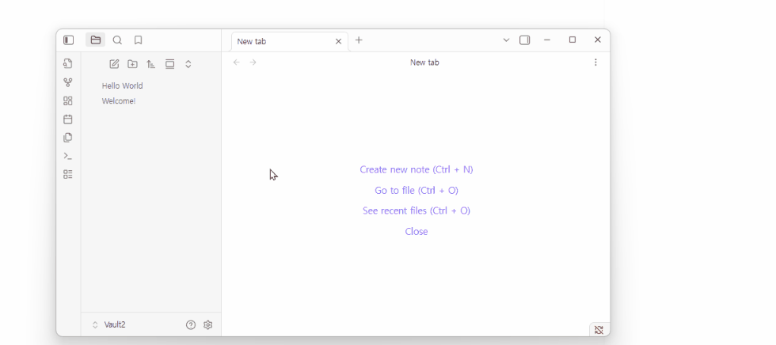

# Smart Tabs (VS Code Style)

> Stop tab clutter. Browse notes like an IDE — with **panel-isolated preview tabs**.

**Smart Tabs** is an Obsidian plugin that replicates VS Code-style tab behavior:
- **Single click** opens a note in a temporary **Preview tab** (italic title)
- **Double click** opens a **Permanent tab**
- Preview auto-locks on **edit**, **rename**, or **double-click**
- Each panel manages its own preview tab independently

---

## Features

### Preview Tabs (per panel)
- Single-click a file to open it in a **Preview tab** (shown with italic title).
- Each panel (tab group) keeps **exactly one preview tab**.
- Browsing files replaces the preview tab instead of creating new tabs.

### Auto-Lock (Promote to Permanent)
A preview tab becomes permanent when you:
- Start **editing** the note body
- Edit the **inline title** (300ms debounce)
- **Rename** the file
- **Double-click** the tab header or sidebar item
- Edit a **Canvas** (add/move/delete nodes or edges)

### Double-Click = Permanent Tab
- Double-clicking a file in the File Explorer, Bookmarks, or Search opens it as a **permanent tab**.
- If a preview of the same file exists, it gets promoted instead of creating a duplicate.

### Smart Reuse & Duplicate Prevention
- If the file is already open in the **same panel**, clicking it again focuses the existing tab.
- This is **panel-isolated** — no cross-panel jumping.

### Supported Sources
All of these follow the same Preview/Permanent pattern:
- File Explorer, Quick Switcher (Ctrl+O), Bookmarks, Search
- Graph View nodes, Wiki-links, Backlinks, Outgoing Links
- Random Note, Canvas, PDF

### New Note Creation
New notes (Ctrl+N, ribbon button, right-click, Daily Notes, Unique Note Creator) always open as **permanent tabs** with title editing mode.

### Modifier Key
- **Ctrl/Cmd + Click** forces a new permanent tab, regardless of existing tabs.

---

## Compatibility

This plugin uses Obsidian workspace internals (monkey-patching `openFile`, `setViewState`, `detach`) on a best-effort basis. If Obsidian changes internal APIs:
- Core behavior will continue to work in most cases
- Tab placement or italic styling may degrade

---

## Known Limitations

- **PDF**: Read-only, so no automatic promotion. Use tab header double-click to manually promote.
- **Recent Files**: Requires a separate plugin ([Recent Files](https://github.com/tgrosinger/recent-files-obsidian)), not tested.
- **Canvas viewport changes** (pan/zoom): Do not trigger promotion (by design — only content edits do).

---

## Contributing

Contributions are welcome! If you find a bug or have a feature request, please open an issue.

---

## Contact & Support

- Issues: https://github.com/devmigi/obsidian-ide-preview/issues
- Email: devmigi619@gmail.com

---

## License

MIT License
